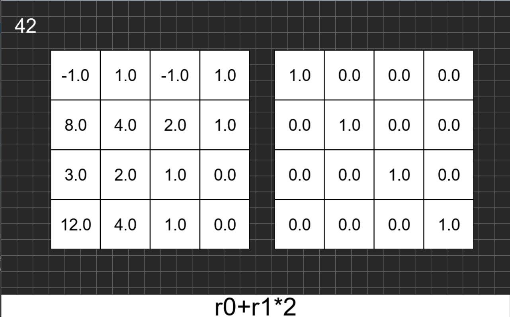

# A simple matrix row manipulator

## Features

- a simple half working tokenizer

### is supposed to help with manual manipualtion with with matricies to get it into the echelon form. Also I understood that if you do not make a copy of an array in python you will have problems

## A couple of screenShots:

